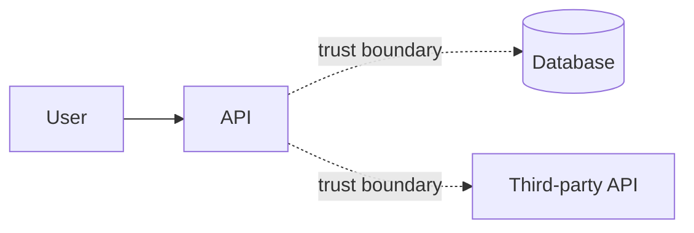

# Threat Model: <feature-or-system>

- **Date**: YYYY-MM-DD
- **Author(s)**:
- **Status**: Draft | Reviewed | Accepted
- **Scope**: <feature, slice or system in scope>
- **Linked spec**: `docs/specs/<feature>.md`
- **Linked ADR(s)**:

## 1. Overview

One paragraph: what is this feature, what data does it handle, where does it
sit in the architecture?

## 2. Assets

What is worth protecting? Examples:

- User credentials
- Payment data
- Personally identifiable information
- Internal API keys / secrets
- Service availability

## 3. Actors

| Actor                     | Trust level | Notes                          |
|---------------------------|-------------|--------------------------------|
| Anonymous user            | untrusted   |                                |
| Authenticated user        | low         | scoped to their own resources  |
| Admin                     | medium      | bypasses some access controls  |
| Internal service          | high        | mTLS, signed requests          |
| External webhook provider | low         | signature-verified payloads    |
| Attacker (external)       | hostile     |                                |

## 4. Data flow diagram

Mark each line crossing a trust boundary with a dashed `-.trust boundary.->`.

## 5. STRIDE analysis

For each component, run STRIDE. Skip categories that don't apply, but say so
explicitly — silence is ambiguous.

| Component | S | T | R | I | D | E | Notes |
|-----------|---|---|---|---|---|---|-------|
| ...       |   |   |   |   |   |   |       |

## 6. Threats (prioritized)

For each identified threat:

### T-NNN [SEVERITY] <Category> — <Short title>

- **Vector**: how the attack works
- **Likelihood**: Low / Medium / High (consider exposure and attractiveness)
- **Impact**: Low / Medium / High / Critical
- **Risk**: L × I
- **Mitigation**:
  - Code: ...
  - Config: ...
  - Infra: ...
  - Process: ...
- **Owner**: <person or team>
- **Tracking**: <issue/ticket id>

## 7. Abuse cases

Things attackers might do that aren't simple "misuse". Examples:

- Authenticated user attempting cross-tenant access
- Bot scraping endpoint without rate limiting
- Race condition on a financial operation
- Replay of a third-party webhook
- Side-channel via timing or error messages

## 8. Residual risk

What you accept after mitigations. State who accepted it and why.

## 9. References

- OWASP Top 10 — https://owasp.org/Top10/
- OWASP ASVS — https://owasp.org/asvs/
- Microsoft STRIDE — https://learn.microsoft.com/en-us/azure/security/develop/threat-modeling-tool
